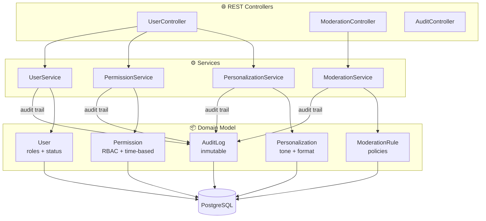

# 🐱 Arenita Admin

Microservicio de administración y personalización para la plataforma Arenita.

## Stack
- **Kotlin** + **Spring Boot 3**
- **PostgreSQL** (H2 para desarrollo)
- **Spring Data JPA** + **Spring Security**
- **JWT** + API Key auth
- **OpenAPI/Swagger**

## Quick Start

### Desarrollo (H2 en memoria)
```bash
./gradlew bootRun --args='--spring.profiles.active=dev'
```

### Producción (Docker)
```bash
docker-compose up -d
```

### Swagger UI
```
http://localhost:8082/swagger-ui/index.html
```

## API Endpoints

### Users
| Method | Path | Description |
|--------|------|-------------|
| POST | `/api/v1/users` | Crear usuario |
| GET | `/api/v1/users` | Listar usuarios (filtros: status, role) |
| GET | `/api/v1/users/{id}` | Obtener usuario |
| GET | `/api/v1/users/external/{externalId}` | Buscar por ID externo (Telegram, etc.) |
| PUT | `/api/v1/users/{id}` | Actualizar usuario |
| POST | `/api/v1/users/{id}/suspend` | Suspender usuario |
| POST | `/api/v1/users/{id}/activate` | Activar usuario |

### Permissions
| Method | Path | Description |
|--------|------|-------------|
| GET | `/api/v1/users/{id}/permissions` | Ver permisos |
| PUT | `/api/v1/users/{id}/permissions` | Configurar permisos |

### Personalization
| Method | Path | Description |
|--------|------|-------------|
| GET | `/api/v1/users/{id}/personalization` | Ver personalización |
| PUT | `/api/v1/users/{id}/personalization` | Actualizar personalización |

### Moderation
| Method | Path | Description |
|--------|------|-------------|
| GET | `/api/v1/moderation/rules` | Listar reglas |
| POST | `/api/v1/moderation/rules` | Crear regla |
| DELETE | `/api/v1/moderation/rules/{id}` | Eliminar regla |

### Audit
| Method | Path | Description |
|--------|------|-------------|
| GET | `/api/v1/audit` | Buscar logs (filtros: userId, adminId, from, to) |

## Permisos disponibles
`SEND_MESSAGES`, `RECEIVE_RESPONSES`, `UPLOAD_FILES`, `USE_IMAGE_GEN`, `USE_VOICE`, `ACCESS_DRIVE`, `ACCESS_EMAIL`, `ACCESS_CALENDAR`

## Roles
- **ADMIN** — acceso completo
- **USER** — acceso estándar
- **RESTRICTED** — acceso limitado

## Personalización por usuario
- **Tone:** FORMAL, CASUAL, SARCASTIC, WARM, PROFESSIONAL
- **Formality:** FORMAL, INFORMAL, MIXED
- **Response format:** CONCISE, BALANCED, DETAILED
- Feature flags y greeting personalizado

## Arquitectura



### Paquetes
```
com.arenita.admin/
├── domain/          # Entidades y repositorios
├── application/     # Servicios de negocio
├── infrastructure/  # Web, seguridad, config
└── api/             # DTOs y mappers
```

## Licencia
MIT
